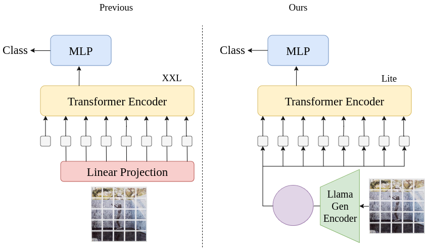

# Tokenized Vision Transformer

This project aims to implement a Tokenized Vision Transformer (T-ViT) model for classification tasks. The T-ViT leverages the strengths of transformer architectures to handle image data efficiently by tokenizing the input images. It processes the images in a discretized domain and classifies them.

## Table of Contents
- [Introduction](#introduction)
- [Installation](#installation)
- [Usage](#usage)

